# Assignment 3 Part 1
## Team members:
- Nurgul Bassanova SE-2323
- Ulzhan Tamyzgazina SE-2325

## Contents
1. [Overview](#overview)  
2. [Prerequisites](#prerequisites)
3. [ERC20 Token Implementation](#erc20-token-implementation)
4. [Set Up and Installation](#setup-and-installation)
5. [Verify Deployment on Sepolia Explorer](#verify-deployment-on-sepolia-explorer)
6. [Conclusion](#conclusion)
7. [License](#license)
8. [References](#references)

## Overview

## Prerequisites
- Remix IDE
- MetaMask Wallet
- VScode 


## ERC20 Token Implementation

### **1. Smart Contract Code**

Create a file **`MyToken.sol`** in Remix and paste the following Solidity code:

```solidity
// SPDX-License-Identifier: MIT
pragma solidity ^0.8.20;

import "@openzeppelin/contracts/token/ERC20/ERC20.sol";

contract UniversityToken is ERC20 {
    address public lastSender;
    address public lastReceiver;
    uint256 public lastTimestamp;

    constructor() ERC20("Ulzhan_Nurgul", "UN") {
        _mint(msg.sender, 2000 * 10**decimals());
    }

    function transfer(address recipient, uint256 amount) public override returns (bool) {
        lastSender = msg.sender;
        lastReceiver = recipient;
        lastTimestamp = block.timestamp;
        return super.transfer(recipient, amount);
    }

    function getLastTransactionTimestamp() public view returns (string memory) {
        return _formatTimestamp(lastTimestamp);
    }

    function getLastSender() public view returns (address) {
        return lastSender;
    }

    function getLastReceiver() public view returns (address) {
        return lastReceiver;
    }

    function _formatTimestamp(uint256 timestamp) internal pure returns (string memory) {
        return string(abi.encodePacked(timestamp));
    }
}
```

### **2. Compile the Contract**

- Open **Remix IDE** → Select Solidity version **0.8.20**.
- Click **Compile MyToken.sol**.

### **3. Deploy the Contract**

- Go to **Deploy & Run Transactions**.
- Select **Injected Provider - MetaMask** (for Sepolia) or **Ganache Provider**.
- Click **Deploy** and confirm the transaction in MetaMask.

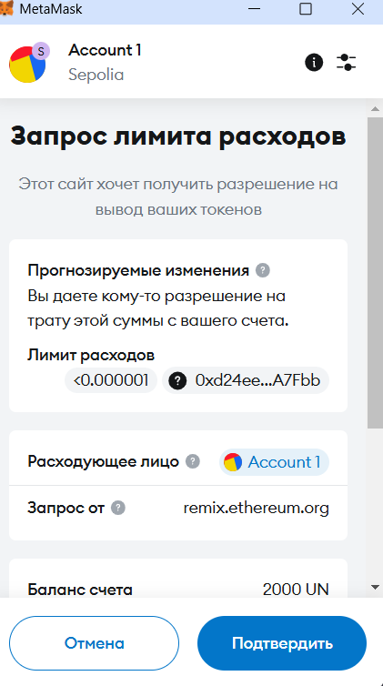

### **4. Interacting with the Contract**

After deploying, use Remix to interact with the contract:

#### **Check Token Balance**

```solidity
balanceOf("your_address")
```

#### **Transfer Tokens**

```solidity
transfer("receiver_address", amount)
```

#### **Retrieve Transaction Details**

- **Last Transaction Timestamp:** `getLastTransactionTimestamp()`
- **Last Sender Address:** `getLastSender()`
- **Last Receiver Address:** `getLastReceiver()`

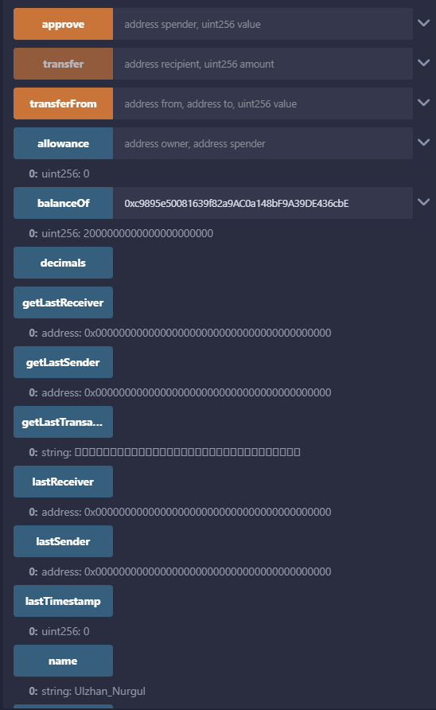
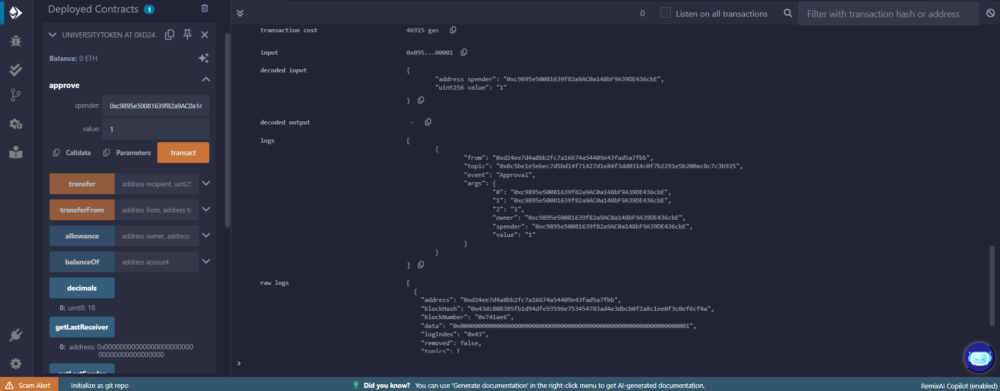

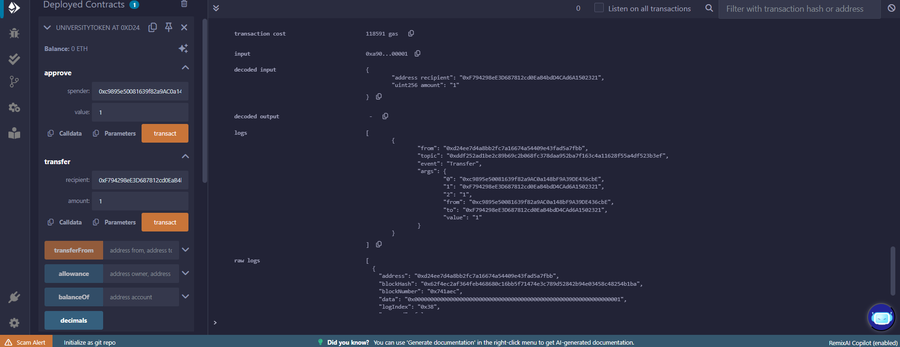

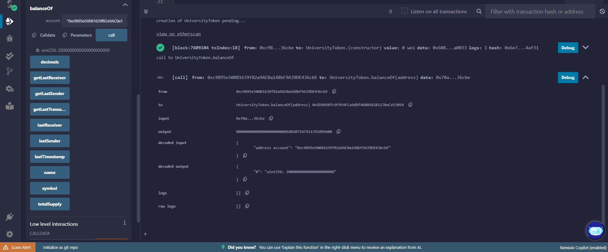

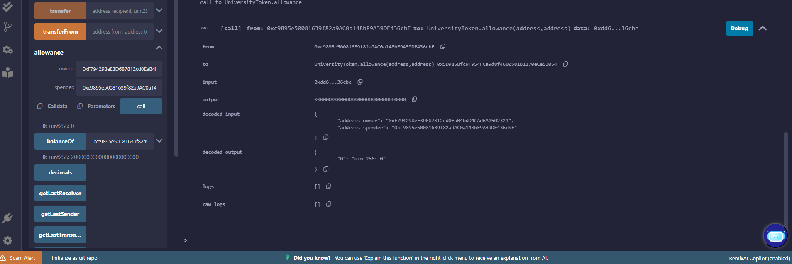

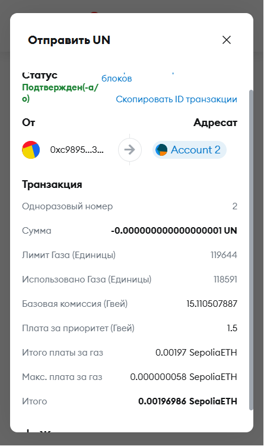

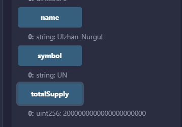

We can check that it's our ERC20 Token by calling these functions. Output shows the name, symbol and total supply as we provided in our smart contract.
## Set Up and Installation

### Setting up the environment
Installing Hardhat using the Node.js package manager (npm), which is both a package manager and an online repository for JavaScript code.
```bash
npm init -y
```

Initializing an npm project as shown below:
```bash
npm init
```

Now Hardhat can be installed:
```bash
npm install --save-dev hardhat
```

In the same directory where you installed Hardhat run:
```bash
npx hardhat init
```

Selecting Create an empty hardhat.config.js from the the output:
```bash
$ npx hardhat init
888    888                      888 888               888
888    888                      888 888               888
888    888                      888 888               888
8888888888  8888b.  888d888 .d88888 88888b.   8888b.  888888
888    888     "88b 888P"  d88" 888 888 "88b     "88b 888
888    888 .d888888 888    888  888 888  888 .d888888 888
888    888 888  888 888    Y88b 888 888  888 888  888 Y88b.
888    888 "Y888888 888     "Y88888 888  888 "Y888888  "Y888

👷 Welcome to Hardhat v2.22.18 👷‍

? What do you want to do? …
  Create a JavaScript project
  Create a TypeScript project
  Create a TypeScript project (with Viem)
❯ Create an empty hardhat.config.js
  Quit
```
When Hardhat is run, it searches for the closest hardhat.config.js file starting from the current working directory.

After writing down everything shown in src folder. We had results which shows that it is deployed:
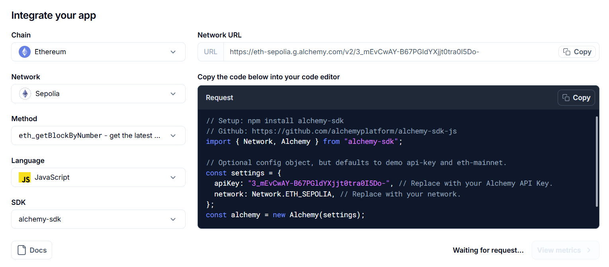

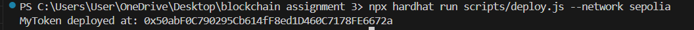

## Verify Deployment on Sepolia Explorer 
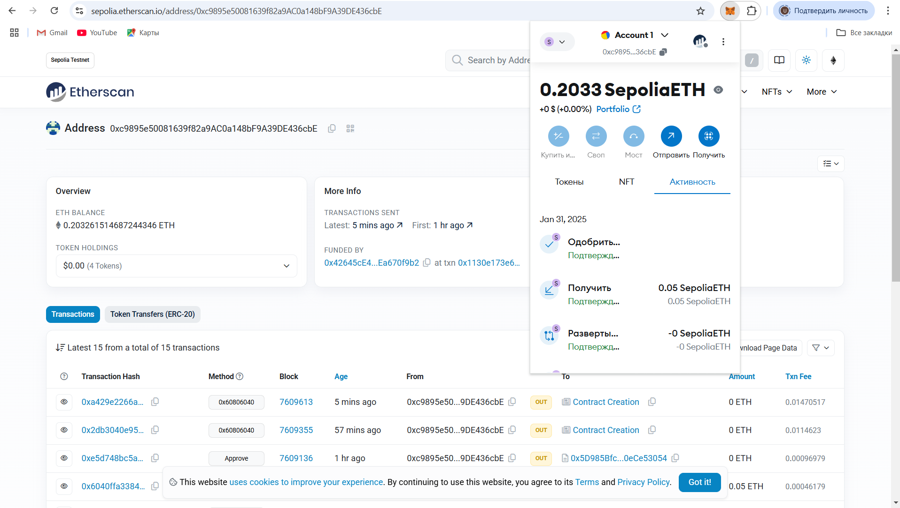

As you can see we checked our account address on etherScan and we can see the all the tranasctions, activities there.

## Conclusion
In this assignment, we successfully developed and deployed an ERC-20 token (Ulzhan_Nurgul - UN) on the Sepolia Testnet using Solidity and Hardhat. The contract includes functions to track transaction details, such as the last sender, receiver, and timestamp.

We also verified the contract on Etherscan, allowing public interaction and transparency. This project provided hands-on experience with smart contract development, deployment, and blockchain interaction using Remix, Hardhat, MetaMask, and Web3.js.

This implementation serves as a strong foundation for understanding token standards and blockchain-based transactions. 
## License
MIT License

Copyright (c) 2025 UN

Permission is hereby granted, free of charge, to any person obtaining a copy
of this software and associated documentation files (the "Software"), to deal
in the Software without restriction, including without limitation the rights
to use, copy, modify, merge, publish, distribute, sublicense, and/or sell
copies of the Software, and to permit persons to whom the Software is
furnished to do so, subject to the following conditions:

The above copyright notice and this permission notice shall be included in all
copies or substantial portions of the Software.

THE SOFTWARE IS PROVIDED "AS IS", WITHOUT WARRANTY OF ANY KIND, EXPRESS OR
IMPLIED, INCLUDING BUT NOT LIMITED TO THE WARRANTIES OF MERCHANTABILITY,
FITNESS FOR A PARTICULAR PURPOSE AND NONINFRINGEMENT. IN NO EVENT SHALL THE
AUTHORS OR COPYRIGHT HOLDERS BE LIABLE FOR ANY CLAIM, DAMAGES OR OTHER
LIABILITY, WHETHER IN AN ACTION OF CONTRACT, TORT OR OTHERWISE, ARISING FROM,
OUT OF OR IN CONNECTION WITH THE SOFTWARE OR THE USE OR OTHER DEALINGS IN THE
SOFTWARE.

## References
- https://www.youtube.com/watch?v=-5j6Ho0Bkfk
- https://www.youtube.com/watch?v=o9Ux3xDrkIo


